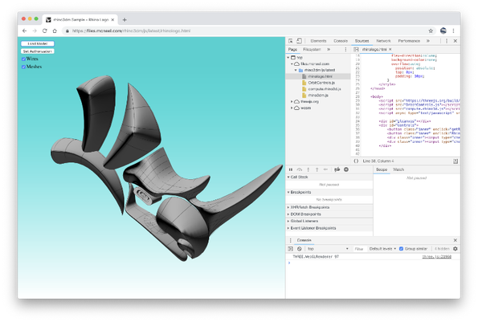

# rhino3dm

[](https://github.com/mcneel/rhino3dm/actions/workflows/workflow_ci.yml)
[](https://discourse.mcneel.com/c/rhino-developer/rhino3dm)
[](https://pypi.org/project/rhino3dm)
[](https://www.nuget.org/profiles/McNeel)
[](https://www.npmjs.com/package/rhino3dm)
[](https://www.jsdelivr.com/package/npm/rhino3dm)

**rhino3dm** is a set of libraries based on the [OpenNURBS](https://developer.rhino3d.com/guides/opennurbs/what-is-opennurbs/) geometry library with a ["RhinoCommon"](https://developer.rhino3d.com/guides/rhinocommon/what-is-rhinocommon/) style. This provides the ability to access and manipulate geometry through .NET, Python or JavaScript applications independent of Rhino.  

Functionality includes

- Create, interrogate, and store all geometry types supported in Rhino. This includes points, point clouds, NURBS curves and surfaces, polysurfaces (B-Reps), meshes, annotations, extrusions, and SubDs.
- Work with non-geometry classes supported in Rhino like layers, object attributes, transforms and viewports
- Read and write all of the above information to and from the *.3dm* file format
- Use as a client to make calls into the [Rhino Compute cloud server](https://www.rhino3d.com/compute) for advanced manipulation of geometry objects
- Available on most platforms (Windows, macOS, Linux)

---

### rhino3dm.py (Python)
**rhino3dm.py** is a python package that can be used on all current versions of CPython (2.7 and 3.7+) and is available on all platforms (Windows, macOS, Linux) [through PyPi.org](https://pypi.org/project/rhino3dm/).

`pip install --user rhino3dm`

See [our python documentation](docs/python/RHINO3DM.PY.md) for details


### rhino3dm.js (Javascript/web assembly)

**rhino3dm.js** is a javascript library with an associated web assembly (rhino3dm.wasm). rhino3dm.js should run on all major browsers as well as [node.js](https://nodejs.org/).

</img>

```html
<!DOCTYPE html>
<html>
  <!-- stuff -->
  <body>
    <script src="https://cdn.jsdelivr.net/npm/rhino3dm@0.12.0/rhino3dm.min.js"></script>
    <script>
      rhino3dm.then((Module) => {
        sphere = new Module.Sphere([1,2,3], 12)
        // more stuff
      })
    </script>
    <!-- even more stuff -->
  </body>
</html>
```

See [our javascript documentation](docs/javascript/RHINO3DM.JS.md) for details

### Rhino3dm.NET

Rhino3dm.NET (formerly known as Rhino3dmIO) allows you to write standalone .NET applications.

We are in transition from compiling Rhino3dm using internal tools to use the code in this repo. If you are not interested in compiling Rhino3dm.NET, then check out the [documentation on installing and using Rhino3dmIO packages on nuget](https://developer.rhino3d.com/guides/opennurbs/what-is-rhino3dmio/)

For compiling Rhino3dm.NET from source, see [our .NET documentation](docs/dotnet/RHINO3DM-BUILD.CS.md) for details

### More

Some more details and discussions can be found at:
  * [Steve Baer's Blog](https://stevebaer.wordpress.com/2018/10/15/rhino3dm-geometry-toolkits-for-net-python-and-javascript/)
  * [discourse.mcneel.com](https://discourse.mcneel.com/c/serengeti/rhino3dm)
